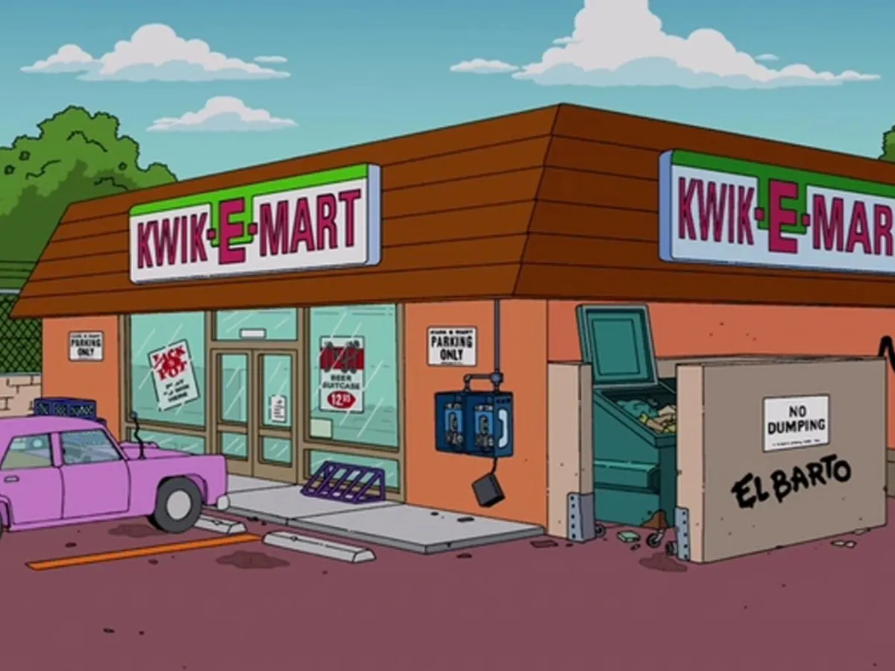

# Text Based Game
## From Ben Tristem's "Complete C# Unity Game Developer" course
It's just a text based minigame about making decisions until you reach your goal.

The theme for this minigame will be (people who know me will guess it easily) **The Simpsons**.

You are Homer, and you are at home just watching TV like any normal Wednesday morning. Marge needs some products from Kwik-E-Mart and you
have to take all these products without any problem.

(Work in progress...)
